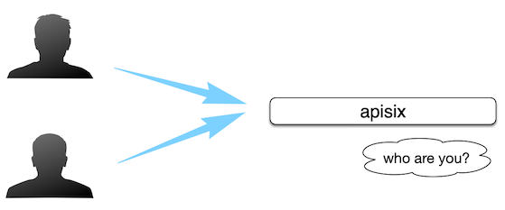
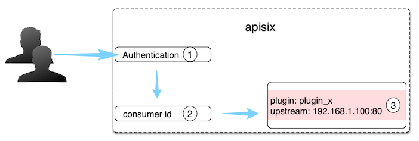

<!--
#
# Licensed to the Apache Software Foundation (ASF) under one or more
# contributor license agreements.  See the NOTICE file distributed with
# this work for additional information regarding copyright ownership.
# The ASF licenses this file to You under the Apache License, Version 2.0
# (the "License"); you may not use this file except in compliance with
# the License.  You may obtain a copy of the License at
#
#     http://www.apache.org/licenses/LICENSE-2.0
#
# Unless required by applicable law or agreed to in writing, software
# distributed under the License is distributed on an "AS IS" BASIS,
# WITHOUT WARRANTIES OR CONDITIONS OF ANY KIND, either express or implied.
# See the License for the specific language governing permissions and
# limitations under the License.
#
-->

For the API gateway, it is usually possible to identify a certain type of requester by using a domain name such as a request domain name, a client IP address, etc., and then perform plugin filtering and forward the request to the specified upstream, but sometimes the depth is insufficient.



As shown in the image above, as an API gateway, you should know who the API Consumer is, so you can configure different rules for different API Consumers.

| Field    | Required | Description                                                                                                                                                                                      |
| -------- | -------- | ------------------------------------------------------------------------------------------------------------------------------------------------------------------------------------------------ |
| username | Yes      | Consumer Name.                                                                                                                                                                                   |
| plugins  | No       | The corresponding plugin configuration of the Consumer, which has the highest priority: Consumer > Route > Service. For specific plugin configurations, refer to the [Plugins](plugin.md) section. |

In APISIX, the process of identifying a Consumer is as follows:



1. Authorization certification: e.g [key-auth](../plugins/key-auth.md), [JWT](../plugins/jwt-auth.md), etc.
2. Get consumer_name: By authorization, you can naturally get the corresponding Consumer `id`, which is the unique identifier of the Consumer object.
3. Get the Plugin or Upstream information bound to the Consumer: Complete the different configurations for different Consumers.

To sum up, Consumer is a consumer of certain types of services and needs to be used in conjunction with the user authentication system.

For example, different consumers request the same API, and the gateway service corresponds to different Plugin or Upstream configurations according to the current request user information.

In addition, you can refer to the [key-auth](../plugins/key-auth.md) authentication authorization plugin call logic to help you further understand the Consumer concept and usage.

How to enable a specific plugin for a Consumer, you can see the following example:

```shell
# Create a Consumer, specify the authentication plugin key-auth, and enable the specific plugin limit-count
$ curl http://127.0.0.1:9080/apisix/admin/consumers -H 'X-API-KEY: edd1c9f034335f136f87ad84b625c8f1' -X PUT -d '
{
    "username": "jack",
    "plugins": {
        "key-auth": {
            "key": "auth-one"
        },
        "limit-count": {
            "count": 2,
            "time_window": 60,
            "rejected_code": 503,
            "key": "remote_addr"
        }
    }
}'

# Create a Router, set routing rules and enable plugin configuration
$ curl http://127.0.0.1:9080/apisix/admin/routes/1 -H 'X-API-KEY: edd1c9f034335f136f87ad84b625c8f1' -X PUT -d '
{
    "plugins": {
        "key-auth": {}
    },
    "upstream": {
        "nodes": {
            "127.0.0.1:1980": 1
        },
        "type": "roundrobin"
    },
    "uri": "/hello"
}'

# Send a test request, the first two return to normal, did not reach the speed limit threshold
$ curl http://127.0.0.1:9080/hello -H 'apikey: auth-one' -I
...

$ curl http://127.0.0.1:9080/hello -H 'apikey: auth-one' -I
...

# The third test returns 503 and the request is restricted
$ curl http://127.0.0.1:9080/hello -H 'apikey: auth-one' -I
HTTP/1.1 503 Service Temporarily Unavailable
...

```

Use the [consumer-restriction](../plugins/consumer-restriction.md) plug-in to restrict the access of Jack to this API.

```shell
# Add Jack to the blacklist
$ curl http://127.0.0.1:9080/apisix/admin/routes/1 -H 'X-API-KEY: edd1c9f034335f136f87ad84b625c8f1' -X PUT -d '
{
    "plugins": {
        "key-auth": {},
        "consumer-restriction": {
            "blacklist": [
                "jack"
            ]
        }
    },
    "upstream": {
        "nodes": {
            "127.0.0.1:1980": 1
        },
        "type": "roundrobin"
    },
    "uri": "/hello"
}'

# Repeated tests, all return 403; Jack is forbidden to access this API
$ curl http://127.0.0.1:9080/hello -H 'apikey: auth-one' -I
HTTP/1.1 403
...

```
